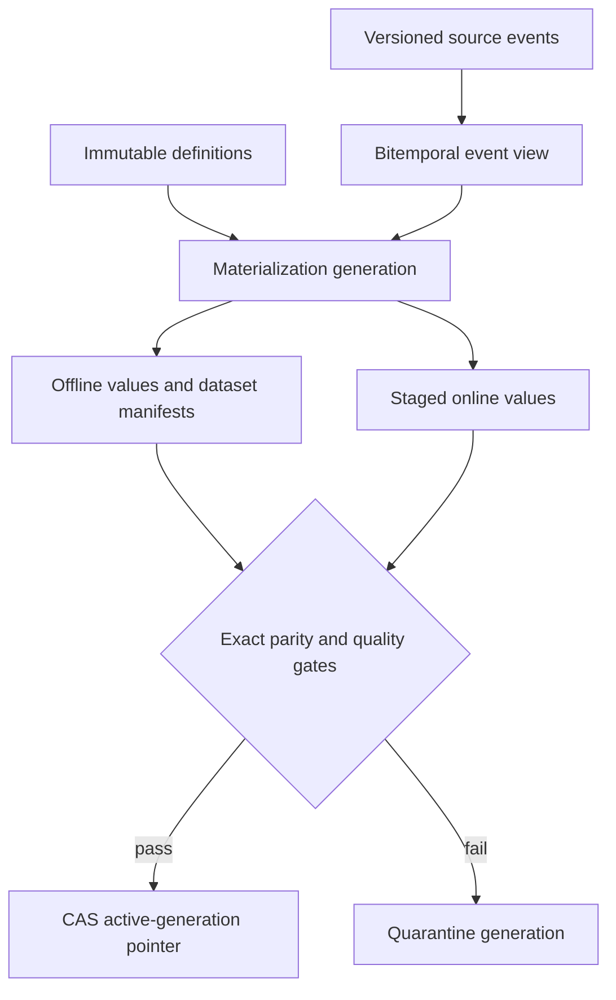

# FeatureForge — ML Feature Platform

[](https://github.com/bhuvaneshwaranmurugan21/featureforge-ml-feature-platform/actions/workflows/ci.yml)
[](https://github.com/bhuvaneshwaranmurugan21/featureforge-ml-feature-platform/actions/workflows/terraform.yml)

FeatureForge is a local bitemporal reference implementation for payment-risk features. Its
checked fixtures exclude late-known corrections from historical training rows, apply typed
retractions only when knowable, reproduce dataset output for identical inputs, and gate a SQLite
online-generation switch on a local offline/online comparison. An independent primitive-record
oracle checks the bounded local temporal histories. Managed execution and independently deployed
offline/online parity remain open.

Its central opinion is that a feature value needs more than an entity, value, and event time:

```text
(entity, feature, value, event_time, knowledge_time, definition_digest, generation)
```

- `event_time`: when the business fact happened;
- `knowledge_time`: when the platform could have known that version of the fact;
- `definition_digest`: the exact computation and contract;
- `generation`: the isolated unit of materialization, backfill, parity, publication, and rollback.

This distinction prevents a late correction, observed after prediction time, from leaking into
a historical training row merely because its business event happened earlier.

## Evidence boundary

- **Executable and locally verified for the recorded fixtures:** revision-aware source events,
  bitemporal point-in-time selection, deterministic revision replay, typed retractions,
  definition immutability, type contracts, idempotent
  materialization, generation isolation, a local offline/online comparison and mismatch gate,
  TTL, and a SQLite compare-and-swap publication decision. The two materialization paths share one
  computation library. Stage 1's temporal oracle is structurally independent of production
  selection and arithmetic, but it is not an independently deployed serving implementation.
- **Production-shaped but not yet verified on AWS:** S3/Glue offline storage, DynamoDB online
  store and registry, Step Functions, EventBridge, KMS, CloudWatch, and Spark adapter.

No online latency, training scale, availability, or AWS cost claim is made without a captured run.
The current dataset manifest records cutoffs, definition digests, row count, and rows digest;
it does not yet bind an immutable source snapshot/content digest. See the
[Stage 0 audit](docs/stage0/README.md),
[Stage 1 temporal authority](docs/stage1/temporal-specification.md), and
[Stage 1 claim registry](docs/stage1/claims.json) for exact evidence and remaining proof gaps.

## Architecture



### What it changes in three common feature architectures

| Common pattern | Normalized failure | FeatureForge correction |
|---|---|---|
| Warehouse SQL features + key-value serving | Similar SQL is reimplemented online | One definition digest and one computation contract bind both paths |
| Offline/online feature store | Event-time join exists, but late knowledge can rewrite history | Every source revision and feature value carries knowledge time |
| Streaming-first features | Hot state is mutable; backfill and rollback are exceptional | Immutable generations make backfill, parity, publish, and rollback normal operations |

FeatureForge is not an attempt to replace Spark, Feast, SageMaker, or DynamoDB. It isolates the
temporal and publication semantics that must remain true whichever engines implement them.

## Point-in-time rule

For event cutoff/label time `L`, prediction knowledge cutoff `K`, and dataset snapshot `A`, a
source revision is eligible only when:

```text
event_time <= L AND knowledge_time <= min(K, A)
```

Within those boundaries, the latest known non-retracted revision of each event is selected.
Equal-knowledge-time conflicts fail closed; input order never breaks a tie. Window and TTL
policies then apply. Every row records requested and effective cutoffs plus truncation, and every
dataset includes label IDs, definition digests, `dataset_as_of`, row count, rows digest, and
manifest digest.

## Included feature product

| Feature | Window | Type | Null/default behavior |
|---|---:|---|---|
| `transaction_count_24h` | 24h | integer | `0` for no events |
| `successful_spend_30d_cents` | 30d | integer | `0` for no successes |
| `failed_payment_ratio_7d` | 7d | float | `0.0` for no payments |
| `hours_since_successful_payment` | 30d | float | null when none exists |
| `max_merchant_risk_7d` | 7d | float | null when none exists |

## Invariants

1. A feature definition version is immutable; changed logic requires a new version.
2. An immutable `revision_id` identifies a revision; conflicting ID reuse and same-clock ties fail closed.
3. Training rows see neither future events nor revisions learned after prediction time.
4. Dataset manifests bind rows to definition digests and source knowledge cutoff.
5. Materialization replay is valid only when its canonical value digest is unchanged.
6. Backfills write a new generation and cannot mutate the active generation.
7. Online staging uses the latest value per entity/feature from one generation.
8. Exact value, timestamp, definition, entity, and generation parity is required.
9. Only parity-proven generations can become active.
10. Publication uses compare-and-swap; a stale publisher cannot overwrite a newer decision.
11. Serving enforces TTL and returns an explicit missing value rather than stale data.

## Run it

Requires Python 3.11+.

```bash
python -m venv .venv
source .venv/bin/activate
python -m pip install -e '.[dev]'
pytest
python -m featureforge.cli simulate --output /tmp/featureforge-evidence.json
```

The local failure lab checks 17 scenarios, including future-event and late-correction exclusion,
definition drift, conflicting event replay, dataset reproducibility, missing entities,
materialization replay, parity failure, type failure, TTL, stale publication, and isolated backfill.
The Stage 1 proof adds typed retractions, hand-calculated boundary fixtures, all 5,040 permutations
of the golden history, 36 bounded cases, and 350 deterministic property examples against an
independent test oracle.

## Repository map

```text
src/featureforge/  bitemporal computation, registry, dataset, parity, and publication kernel
tests/             temporal leakage, failure, parity, and replay tests
contracts/         versioned source contract
jobs/              production-shaped Spark point-in-time adapter
infra/terraform/   AWS reference topology
evidence/          reproducible local proof artifact
docs/              ADR, runbook, failure lab, and claim registry
```

## Production mapping

| Semantic object | Local oracle | AWS reference component |
|---|---|---|
| Versioned source facts | SQLite event revisions | S3/Iceberg bitemporal source table |
| Immutable definition | In-memory registry + digest | DynamoDB registry + deployment artifact digest |
| Offline generation | SQLite values | S3/Glue/Iceberg generation namespace |
| Online generation | SQLite online table | DynamoDB generation-prefixed keys |
| Dataset manifest | Canonical JSON digest | Versioned, KMS-encrypted S3 evidence |
| Atomic publication | SQLite CAS | DynamoDB conditional pointer update |

See [Architecture](docs/architecture.md) for primary references and [Runbook](docs/runbook.md)
for the exact evidence required before any managed-runtime claim.

## Interview walkthrough

Use one late correction: payment `p-1` occurred at 10:00, the prediction was made at 10:05,
and the correction arrived at 10:10. Event-time-only backfills leak the corrected value into the
10:05 row. FeatureForge retains both clocks, reconstructs what was knowable at 10:05, binds the
result to a definition digest, and publishes serving state only after parity.

## License

MIT
