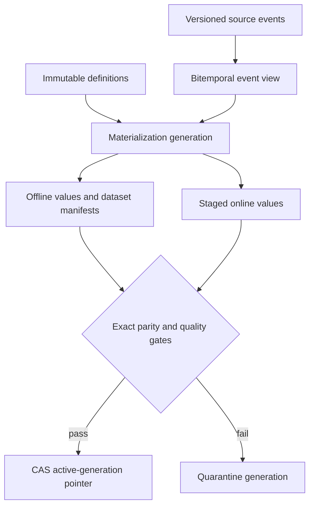

# FeatureForge — ML Feature Platform

[](https://github.com/bhuvaneshwaranmurugan21/featureforge-ml-feature-platform/actions/workflows/ci.yml)
[](https://github.com/bhuvaneshwaranmurugan21/featureforge-ml-feature-platform/actions/workflows/terraform.yml)

FeatureForge is a local bitemporal reference implementation for payment-risk features. Its
checked fixtures exclude late-known corrections from historical training rows, apply typed
retractions only when knowable, reproduce provenance-bound dataset output for identical inputs,
and gate a file-backed SQLite generation switch on persisted validation evidence. An independent
primitive-record oracle checks bounded historical and current views. The local lifecycle includes
semantic CAS contention, generation-pinned reads, restart-safe idempotency, lost-acknowledgement
recovery, TTL, and guarded rollback. Managed execution remains open.
Stage 3 adds a real local Java 17/PySpark 3.5.9 computation path, conservative affected-scope
planning, target-frontier re-enveloping, immutable manifest-bound offline generations, and an
incremental-versus-full-rebuild differential proof.
Stage 4 adds an isolated online-generation materialization contract, exact paginated reconciliation,
receipt-bound activation, request-scoped generation pinning, typed serving outcomes, and deterministic
recovery. Its DynamoDB request dictionaries are statically validated against the pinned Botocore
service model; no live AWS execution is claimed.
Stage 5 adds a standard-library-only expected-state projector, exhaustive policy-gated parity,
content-addressed activation decisions, controlled-clock freshness semantics, bounded telemetry,
and a frozen 3-by-3 local benchmark with all 486 correctness-bound raw trials retained.

Its central opinion is that a feature value needs more than an entity, value, and event time:

```text
(entity, feature, value, event_time, knowledge_time, definition_digest, generation)
```

- `event_time`: when the business fact happened;
- `knowledge_time`: when the platform could have known that version of the fact;
- `definition_digest`: the exact computation and contract;
- `generation`: the isolated unit of materialization, backfill, parity, publication, and rollback.

This distinction prevents a late correction, observed after prediction time, from leaking into
a historical training row merely because its business event happened earlier.

## Evidence boundary

- **Executable and locally verified for the recorded fixtures:** revision-aware source events,
  bitemporal point-in-time selection, deterministic revision replay, typed retractions,
  definition immutability, type contracts, idempotent
  materialization, immutable source/label/dataset manifests, persistent definition authority,
  generation isolation, evidence-derived readiness, semantic compare-and-swap contention,
  generation-pinned reads, restart-safe operation replay, lost-ack recovery, guarded rollback,
  and definition-bound TTL. Stage 2's primitive-record oracle is structurally independent of
  production selection, computation, dataset, lifecycle, and canonicalization code, but it is not
  an independently deployed serving implementation. Stage 3's separate primitive-record oracle
  checks all five Spark-computed features at three knowledge frontiers; seeded balanced, skewed,
  and high-cardinality workloads provide bounded structural diagnostics.
  Stage 4's independent serializer oracle checks the canonical online envelopes; its file-backed
  adapter verifies isolation, reconciliation, concurrent CAS, pinned reads, and restart recovery.
- **Locally measured under the frozen Stage 5 environment only:** nine bounded workload cases,
  nine separately timed operations, one cold plus five warm trials, immutable raw measurements,
  and reproducible summaries. These results are not cloud or production performance evidence.
- **Implementation-present and statically validated:** DynamoDB low-level record, query,
  candidate-control, conditional-write, and transactional activation request shapes.
- **Production-shaped but not yet verified on AWS:** S3/Glue offline storage, live DynamoDB online
  behavior, Step Functions, EventBridge, KMS, and CloudWatch.

No online latency, training scale, availability, or AWS cost claim is made without a captured run.
The Stage 2 dataset manifest binds immutable source, label, definition-set, code, cutoff, count,
and ordered-row identities. See the
[Stage 0 audit](docs/stage0/README.md),
[Stage 1 temporal authority](docs/stage1/temporal-specification.md), and
[Stage 2 lifecycle authority](docs/stage2/lifecycle-specification.md), and
[Stage 3 Spark authority](docs/stage3/spark-incremental-specification.md), and
[Stage 4 online authority](docs/stage4/online-materialization-specification.md), and
[Stage 5 platform authority](docs/stage5/parity-activation-specification.md) for exact evidence and
remaining proof gaps.

## Architecture


```mermaid
flowchart TD
    A["Versioned source events"] --> B["Bitemporal event view"]
    C["Immutable definitions"] --> D["Materialization generation"]
    B --> D
    D --> E["Offline values and dataset manifests"]
    D --> F["Staged online values"]
    E --> G{"Exact parity and quality gates"}
    F --> G
    G -->|pass| H["CAS active-generation pointer"]
    G -->|fail| I["Quarantine generation"]
```

### What it changes in three common feature architectures

| Common pattern | Normalized failure | FeatureForge correction |
|---|---|---|
| Warehouse SQL features + key-value serving | Similar SQL is reimplemented online | One definition digest and one computation contract bind both paths |
| Offline/online feature store | Event-time join exists, but late knowledge can rewrite history | Every source revision and feature value carries knowledge time |
| Streaming-first features | Hot state is mutable; backfill and rollback are exceptional | Immutable generations make backfill, parity, publish, and rollback normal operations |

FeatureForge is not an attempt to replace Spark, Feast, SageMaker, or DynamoDB. It isolates the
temporal and publication semantics that must remain true whichever engines implement them.

## Point-in-time rule

For event cutoff/label time `L`, prediction knowledge cutoff `K`, and dataset snapshot `A`, a
source revision is eligible only when:

```text
event_time <= L AND knowledge_time <= min(K, A)
```

Within those boundaries, the latest known non-retracted revision of each event is selected.
Equal-knowledge-time conflicts fail closed; input order never breaks a tie. Window and TTL
policies then apply. Every row records requested and effective cutoffs plus truncation, and every
dataset includes label IDs, definition digests, `dataset_as_of`, row count, rows digest, and
manifest digest.

## Included feature product

| Feature | Window | Type | Null/default behavior |
|---|---:|---|---|
| `transaction_count_24h` | 24h | integer | `0` for no events |
| `successful_spend_30d_cents` | 30d | integer | `0` for no successes |
| `failed_payment_ratio_7d` | 7d | float | `0.0` for no payments |
| `hours_since_successful_payment` | 30d | float | null when none exists |
| `max_merchant_risk_7d` | 7d | float | null when none exists |

## Invariants

1. A feature definition version is immutable; changed logic requires a new version.
2. An immutable `revision_id` identifies a revision; conflicting ID reuse and same-clock ties fail closed.
3. Training rows see neither future events nor revisions learned after prediction time.
4. Dataset manifests bind rows to definition digests and source knowledge cutoff.
5. Materialization replay is valid only when its canonical value digest is unchanged.
6. Backfills write a new generation and cannot mutate the active generation.
7. Online staging uses the latest value per entity/feature from one generation.
8. Exact value, timestamp, definition, entity, and generation parity is required.
9. Only generations with a persisted, passing, artifact-bound validation receipt can become active.
10. Publication uses expected-generation and expected-version CAS; a stale publisher or rollback cannot overwrite a newer decision.
11. One logical read pins one generation; publication cannot mix values inside the request.
12. Exact operation replay returns the committed receipt; conflicting operation reuse fails closed.
13. TTL comes from the persisted definition; synchronous serving returns `EXPIRED` at equality.
14. Incremental scope may over-select but cannot omit a changed feature key.
15. Preserved values are re-enveloped at the target generation and knowledge frontier.
16. A corrupt predecessor, unsafe scope, partial artifact, or digest mismatch cannot yield a
    successful incremental generation.
17. An online candidate remains invisible until exact reconciliation and receipt-bound activation.
18. Online publication requires an expected-generation/version CAS and records immutable history.
19. A logical online request pins one generation; pointer movement cannot mix its feature values.
20. DynamoDB cleanup TTL is never used as the serving-eligibility authority.
21. Stage 5 activation requires all nine receipt-backed gates and persists the decision before CAS.
22. Bounded candidates use exhaustive independent parity; deterministic samples are diagnostic only.
23. Correctness uses controlled logical time while durations use a monotonic clock.

## Run it

Requires Python 3.11+ and Java 17.

```bash
python -m venv .venv
source .venv/bin/activate
python -m pip install -e '.[dev,spark,aws]'
pytest
python -m featureforge.cli simulate --output /tmp/featureforge-evidence.json
python -m tools.run_stage2_proof --output-dir /tmp/featureforge-stage2-evidence
python -m tools.run_stage3_proof --output-dir /tmp/featureforge-stage3-evidence
python -m tools.run_stage4_proof --output-dir /tmp/featureforge-stage4-evidence
python -m tools.run_stage5_proof --output-dir /tmp/featureforge-stage5-evidence
python -m tools.summarize_stage5_benchmark --raw evidence/stage5/benchmark-raw.json --output /tmp/featureforge-stage5-benchmark-summary.json
python tools/validate_stage5.py
```

The local failure lab checks 17 scenarios, including future-event and late-correction exclusion,
definition drift, conflicting event replay, dataset reproducibility, missing entities,
materialization replay, parity failure, type failure, TTL, stale publication, and isolated backfill.
The Stage 1 proof adds typed retractions, hand-calculated boundary fixtures, all 5,040 permutations
of the golden history, 36 bounded cases, and 350 deterministic property examples against an
independent test oracle. Stage 2 adds a 20-point persisted failure matrix, strict ingestion and
artifact integrity, independent training/current-view agreement, a real two-connection semantic
CAS loser, reader pinning across a switch, restart and lost-ack replay, and guarded rollback.
Stage 3 adds exact Spark/oracle agreement at three knowledge frontiers, source/definition/customer
order invariance, an integer-precision guard, incremental/full equality, conservative-scope mutation
testing, three seeded workload profiles, and immutable-artifact restart/tamper/fallback recovery.
Stage 4 adds canonical online-record/oracle agreement, valid low-level DynamoDB request shapes,
four-page exact reconciliation, a real two-connection activation race, lost-ack restart replay,
typed TTL/freshness results, durable retry attempts, and bounded service-limit calculations.
Stage 5 adds exhaustive independent online parity, every nine-gate negative control, policy-bound
activation receipts, stale-decision CAS proof, bounded telemetry validation, and a retained 486-trial
local benchmark with deterministic summary regeneration.

## Repository map

```text
src/featureforge/  bitemporal computation, Spark backfill, online materialization, and publication kernel
tests/             temporal leakage, failure, parity, and replay tests
contracts/         versioned source contract
jobs/              bounded local Spark point-in-time entry point
infra/terraform/   AWS reference topology
evidence/          reproducible local proof artifact
docs/              ADR, runbook, failure lab, and claim registry
```

## Production mapping

| Semantic object | Local oracle | AWS reference component |
|---|---|---|
| Versioned source facts | SQLite event revisions | S3/Iceberg bitemporal source table |
| Immutable definition | Persistent SQLite authority + digest | DynamoDB registry + deployment artifact digest |
| Offline generation | SQLite values | S3/Glue/Iceberg generation namespace |
| Online generation | File-backed SQLite candidate namespace | DynamoDB generation-prefixed keys |
| Dataset manifest | Canonical JSON digest | Versioned, KMS-encrypted S3 evidence |
| Atomic publication | SQLite CAS | DynamoDB conditional pointer update |

See [Architecture](docs/architecture.md) for primary references and [Runbook](docs/runbook.md)
for the exact evidence required before any managed-runtime claim.

## Interview walkthrough

Use the [Stage 5 walkthrough](docs/stage5/walkthrough.md): connect immutable corrections, Spark
full/incremental equality, independent expected state, exhaustive parity, composite activation,
controlled freshness, operator diagnosis, raw measurements, variability, and explicit non-claims.

## License

MIT
