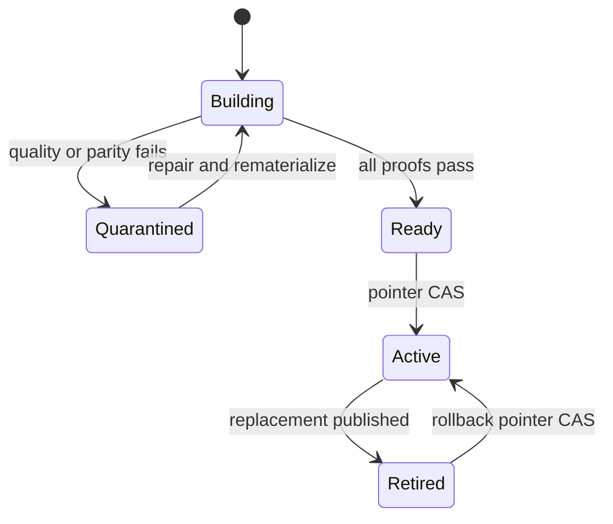

# Architecture decision record

## Decision

Adopt **bitemporal feature generations**.

Business time answers “when did the fact occur?” Knowledge time answers “when could this
platform have used this revision?” Both are required to make historical training defensible.
A generation binds the source frontier, `dataset_as_of`, feature-definition set, offline values,
staged online values, parity report, and publication decision.

## Temporal semantics

For each label, resolve the source as it was known at `min(label_time, dataset_as_of)`. Select
the latest eligible revision for each event, then apply `event_time <= label_time`, feature
window, and TTL. This remains deterministic even when a source corrects historical events.

## Publication semantics

Materialization never writes into the active serving namespace. A new generation is built in
isolation. Offline and staged online values are compared across value, event time, knowledge
time, definition digest, entity, and feature. A DynamoDB conditional update changes the active
pointer only after every gate passes. The preceding generation is retained for rollback.

## State machine

## Serving behavior

The online store contains one latest record per generation/entity/feature. A read first resolves
the active generation, then looks up the feature and enforces TTL. Missing and expired values
remain explicit; defaulting belongs to the model contract, not hidden storage behavior.

## Primary references

- [Feast point-in-time joins](https://docs.feast.dev/getting-started/concepts/point-in-time-joins)
- [Feast feature views and TTL](https://docs.feast.dev/getting-started/concepts/feature-view)
- [Feast materialization](https://docs.feast.dev/getting-started/concepts/feature-retrieval)
- [Amazon SageMaker Feature Store concepts](https://docs.aws.amazon.com/sagemaker/latest/dg/feature-store.html)
- [DynamoDB conditional expressions](https://docs.aws.amazon.com/amazondynamodb/latest/developerguide/Expressions.ConditionExpressions.html)
- [Apache Iceberg branching and tagging](https://iceberg.apache.org/docs/latest/branching/)
