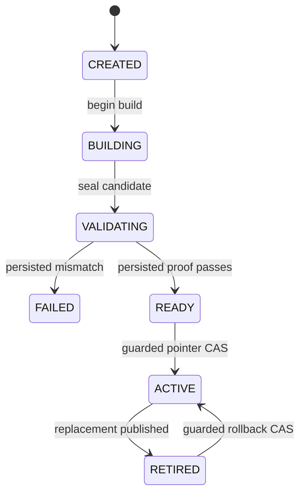

# Architecture decision record

## Decision

Adopt **bitemporal feature generations**.

Business time answers “when did the fact occur?” Knowledge time answers “when could this
platform have used this revision?” Both are required to make historical training defensible.
A generation binds immutable source and label snapshots, `dataset_as_of`, the persisted
feature-definition set, code identity, offline dataset, explicit current-view candidate,
validation receipt, and publication decision.

## Temporal semantics

For each label, resolve the source as it was known at `min(label_time, dataset_as_of)`. Select
the latest eligible revision for each event, then apply `event_time <= label_time`, feature
window, and TTL. This remains deterministic even when a source corrects historical events.

## Publication semantics

Materialization never writes into the active serving namespace. Locally, a new generation is built
in isolation and becomes `READY` only from persisted artifact-link, count, digest, and exact-row
validation. `BEGIN IMMEDIATE` then atomically checks expected generation/version, updates the
pointer and statuses, appends history, and stores an idempotent receipt. The AWS mapping remains a
design reference rather than Stage 2 evidence.

## State machine

## Serving behavior

The online store contains one record per generation/entity/feature. A logical read resolves the
active generation once and keeps that token for every feature lookup. TTL is loaded from the
persisted definition bound to the value. Missing and expired values remain explicit; defaulting
belongs to the model contract, not hidden storage behavior.

## Spark backfill semantics

The Stage 3 local Spark path ranks source revisions by knowledge time for each logical event, removes
retracted state, then applies event and feature-window cutoffs. Full output is canonicalized and bound
to an immutable generation manifest. Incremental planning compares authoritative event state between
two knowledge frontiers and conservatively marks every definition whose old or new event time can
enter its window. A threshold selects a full rebuild. Otherwise Spark recomputes affected customers,
unaffected values are re-enveloped under the target frontier, and the complete output must equal an
independent full rebuild. See `docs/stage3/spark-incremental-specification.md`.

## Primary references

- [Feast point-in-time joins](https://docs.feast.dev/getting-started/concepts/point-in-time-joins)
- [Feast feature views and TTL](https://docs.feast.dev/getting-started/concepts/feature-view)
- [Feast materialization](https://docs.feast.dev/getting-started/concepts/feature-retrieval)
- [Amazon SageMaker Feature Store concepts](https://docs.aws.amazon.com/sagemaker/latest/dg/feature-store.html)
- [DynamoDB conditional expressions](https://docs.aws.amazon.com/amazondynamodb/latest/developerguide/Expressions.ConditionExpressions.html)
- [Apache Iceberg branching and tagging](https://iceberg.apache.org/docs/latest/branching/)
